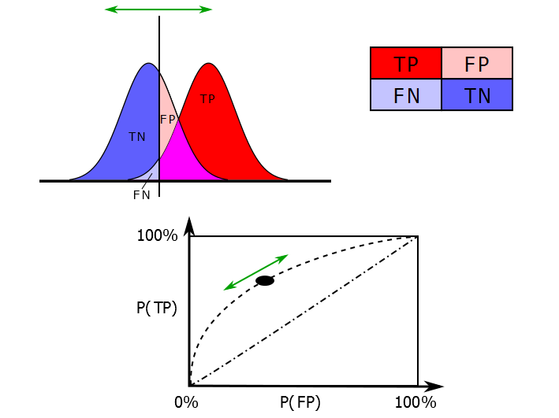

```{r setup, include=FALSE, echo = FALSE}
knitr::opts_chunk$set(echo = FALSE, warning = FALSE, message = FALSE)

HEXSIZE = "1"

ONLOCAL = T

if(ONLOCAL){
  codeloc = "~/git/SDI_Waze"
  inputdir <- file.path("W:/SDI Pilot Projects/Waze/MASTER Data Files/Waze Aggregated/HexagonWazeEDT/WazeEDT Agg", HEXSIZE,"mile Rdata Input")
  outputdir1 <- file.path("//vntscex.local/DFS/Projects/PROJ-OR02A2/SDI/Model_Output/RF1")
  outputdir2 <- file.path("//vntscex.local/DFS/Projects/PROJ-OR02A2/SDI/Model_Output/RF2")

  localdir <- outputdir1 
  } else {
  codeloc <- "~/SDI_Waze" 
  inputdir <- paste0("WazeEDT_Agg", HEXSIZE, "mile_Rdata_Input")
  outputdir <- paste0("WazeEDT_Agg", HEXSIZE, "mile_RandForest_Output")
  aws.signature::use_credentials()
  waze.bucket <- "ata-waze"
  localdir <- "/home/dflynn-volpe/workingdata" 
}

library(knitr)
library(kableExtra)
library(randomForest)
library(aws.s3)
library(tidyverse)
library(pander)
library(DT)
# Run this if you don't have these packages:
# install.packages(c("kableExtra","randomForest","aws.s3","tidyverse","pander","DT"), dep = T)

knitr::opts_knit$set(root.dir = localdir)
# setwd(localdir)
# read utility functions
source(file.path(codeloc, 'utility/wazefunctions.R'))

# read random forest function
source(file.path(codeloc, "analysis/RandomForest_WazeGrid_Fx.R"))
```

# Random Forest Overview

For the SDI Waze project, the analysis being used is a estimation of EDT crashes, based on Waze predictors. Currently, there are seven months of data where geolocated EDT and Waze data are available, from March - September, 2017, for Maryland. The models developed to date are training on data for which the presence of an EDT crash (binary) or count of EDT crashes is modeled based on a large number of predictors from the Waze data, such as number of Waze accidents, the type of Waze events, number of Waze events in total, and other variables. 

A random forest model trained on known data can then be employed on data for which only Waze data are provided. This would be the case if incoming Waze data is used to estimate the number and spatial/temporal pattern of EDT-level crashes for times or states when EDT data are not available. In the model development process, the testing is done for a subset of the data where the known EDT values are held back, and then the estimates produced by the model fit to training data can be compared to the known data. A goal of the SDI Waze project is to produce estimated EDT-level crash counts which best fit the observed data in terms of overall accuracy and precision in spatial and temporal patterns. 

The first phase of random forest models aimed to resolve initial questions about what features to include, as well as the consequence of adding months of data and the spatial grain of the data aggregation. The first phase used April, May, and June 2017 data from Maryland. Additional features beyond Waze data included hourly weather features, roadway characteristics, and socio-economic variables from census sources. 

The second phase of random forest models included a complete set of predictor features, including historical FARS accident counts, and average annual daily traffic (AADT). The second phase also extended the time extent of the training and testing across all available months of complete data, April - September 2017 for Maryland. 

There are multiple criteria for evaluating classification and regression models. For all the models, we used two different data sets to train and test the model. *Training* refers to fitting the model parameters with a large set of known EDT crashes and associated Waze events and other predictors, while *testing* refers to applying the fitted model parameters to a new set of Waze events and other predictors, generating estimated EDT crashes. The estimated EDT crashes are then compared to the known, observed EDT crashes in the test data set to evaluate model performance.

Here we use three criteria, each of which can also be applied to the regularized regression models in the next phase:

**1. Diagnostics from a confusion matrix**

  For binary classification models, it is possible to create a 2x2 table where columns are observed negative and positive, and rows are predicted negative and positive. This is know as a *confusion matrix*, and shows four quantities to represent model performance:

```{r diagtable, results = "asis"}
tabl <- "
 |          |        |       OBSERVED     |
 |----------|--------|:-------:|:--------:| 
 |          |        |Negative | Positive |
 |<b>PREDICTED |Negative|   TN    |    FN |
 |          |Positive|   FP    |    TP    |
"
pander::pander(tabl, style = "rmarkdown")
```

False positives (FP) can be considered Type I errors, and false negatives (FN) can be considered Type II errors. 

  - *Accuracy* = TN + TP / All observations 
    + True positives and true negatives divided by all observations. A high value indicates that the observed occurrences and absences of EDT crashes are correctly being estimated. 
  
  - *Precision* = TP / FP + TP 
     + True positives divided by all predicted positives. A high value indicates that there are relatively few false positives (locations and times where a crash is estimated, but did not actually occur).
  
  - *Recall* = TP / FN + TP
    + True positives divided by all observed positives. This is also called *Sensitivity*, or the *true postitive rate*. A high value indicates that there are relatively few false negatives (locations and times where a crash was not estimated, but did actually occur).
  
  - *False Positive Rate* = FP / TN + FP
    + False positives divided by all observed negatives. A low value indicates that there are relatively few false positives compared to all observed absences of EDT crashes.


**2. Mean Squared Error**

For binary and continuous models, mean squared error is simply the mean squared residual between observed and estimated values.  

**3. Area under Reciever-Operator Characteristic Curve (AUROC, ROC curve)**

For a binary model, we can additionally calculate one other quantity:

  - *Specificity* = TN / TN + FP
  + True negatives divided by all observed negatives, also called the true negative rate.

Balancing between high specificity (where false positives are avoided) and high sensitivity (where false negatives are avoided) is an important decision point in evaluating a model. High sensitivity (i.e., recall or true positive rate) with high specificity (low false positive rate) is ideal. Plotting the false positive rate versus the true positive rate allows a visualization of this balance, and is known the 'receiver-operator characteristic (ROC) curve'. The larger the area under the ROC curve, the more high specificity is maximized with low loss of sensitivity. An area of 0.5 is equivalent to flipping a coin; and area of 1 is perfect estimation, with no false positives or false negatives. 

```{r roc, echo=FALSE, fig.cap="ROC curves, [CC BY-SA 3.0 Wikimedia](https://commons.wikimedia.org/w/index.php?curid=44059691)", out.width = '50%'}

```


# Phase 1 model testing

       

### Spatial grain
We tested three options, and and selected 1 mile grid size for all future work. Models at the larger spatial grain (4 square mile hexagonal grid cells) or smaller spatial grain (0.5 square mile hexagonal grid cells) performed relatively similar. There was a small performance gain at the 0.5 mile grain size in some cases. however, run time was substantially longer for data preparation (including approximately **36** hours of computational time per month of data to prepare weather variables at 0.5 mile grid size, compared to approximately **6** hours for a similar process for 1 mile grid cells), and substantially longer for model fitting (xx vs. xx), with 66,220 grid cells at 0.5 square miles versus 33,184 grid cells at 1 square miles.

```{r phase1spatial, echo = F}
load(file.path(localdir, "Outputs_up_to_17"))

# pairs to compare: 01, 04, 06 - April
# 03, 05, 07 - April+May, test on June

Diag.frame <- vector()
for(i in c("01", "04", "06")){
  Diag.frame <- rbind(Diag.frame, c(keyoutputs[[i]][[3]]))
 }

colnames(Diag.frame)[1:4] = c("Accuracy", "Precision", "Recall", "False Positive Rate")
Diag.frame[,1:4] = Diag.frame[,1:4]*100

rownames(Diag.frame) = c("Model 01 - 1 mile", "Model 04 - 4 mile", "Model 06 - 0.5 mile")
kable(Diag.frame, 
          caption = "Phase 1 model diagnostics for April 2017",
          rownames = "Model")


Diag.frame <- vector()
for(i in c("03", "05", "07")){
  Diag.frame <- rbind(Diag.frame, c(keyoutputs[[i]][[3]]))
 }

colnames(Diag.frame)[1:4] = c("Accuracy", "Precision", "Recall", "False Positive Rate")
Diag.frame[,1:4] = Diag.frame[,1:4]*100

rownames(Diag.frame) = c("Model 03 - 1 mile", "Model 05 - 4 mile", "Model 07 - 0.5 mile")
kable(Diag.frame, 
          caption = "Phase 1 model diagnostics for April + May, test on June",
          rownames = "Model")

```   

### Time windows
Deferred: Using with 1 hr aggregations for all models
4hr windows would require new aggregation in GridAggregation.R

 - 1 hr
 - 4 hr

### Neighbors
Grid cells 

 - Without 
 - With

### Model versions

- April, 70/30 split between training and test data
- April + May, 70/30 split between training and test data
- April + May, complete data used, test on June

## General summary 
What we learned from this testing is the following:

- 1mi grid size is best. There was 

- Adding more months of data does not really improve model: focus on adding data features
- Run future models on April-Sept (6 months) with 70/30 training/test split

Some improvements with some new data features. Expand testing in next phase
Something about neighbors?

```{r keyoutputsummary1}
load(file.path(localdir, "Outputs_up_to_17"))

# Summary from keyoutputs ----
Nobs.frame <- vector()

for(i in 1:length(keyoutputs)){
  Nobs.frame <- rbind(Nobs.frame, c(Model = i, keyoutputs[[i]][[1]]))
 }

datatable(Nobs.frame, filter = 'top',
          caption = "Phase 1 model inputs. N: total rows of input training data; No EDT = number rows without EDT crashes; EDT present: number of rows with EDT crashes; Waze accident present: Number of rows at least one `WazeAccident` present",
          rownames = T,
          options = list(dom = "tip",
                         #order = list(list(1, 'desc')),
                         pageLength = 5)
          ) %>% formatCurrency(2:5, currency = "", digits = 0)

```

```{r Diagframe1}
Diag.frame <- vector()

for(i in 1:length(keyoutputs)){
  Diag.frame <- rbind(Diag.frame, c(Model = i, keyoutputs[[i]][[3]]))
 }

colnames(Diag.frame)[2:5] = c("Accuracy", "Precision", "Recall", "False Positive Rate")
Diag.frame[,1] = as.factor(Diag.frame[,1])
Diag.frame[,2:5] = Diag.frame[,2:5]*100

datatable(Diag.frame, filter = 'top',
          caption = "Phase 1 model diagnostics. Best values are highlighed in green.",
          rownames = T,
          options = list(dom = "tip",
                         order = list(list(1, 'desc')),
                         pageLength = 5)
          ) %>% formatCurrency(2:5, currency = "", digits = 2) %>%
          formatStyle(2, background = styleEqual(max(Diag.frame[,2]), 'lightgreen'))%>%
          formatStyle(3, background = styleEqual(max(Diag.frame[,3]), 'lightgreen'))%>%
          formatStyle(4, background = styleEqual(max(Diag.frame[,4]), 'lightgreen'))%>%
          formatStyle(5, background = styleEqual(min(Diag.frame[,5]), 'lightgreen'))
```

```{r m01-03}
modelno = "16"

if(ONLOCAL) {load(file.path(outputdir1, paste("Model", modelno, "RandomForest_Output_04.RData", sep= "_")))} else {s3load(object = file.path(outputdir, paste("Model", modelno, "RandomForest_Output.RData", sep= "_")), bucket = waze.bucket)}


rf.04$call
kable(round(rf.04$importance[order(rf.04$importance, decreasing = T),], 3))


modelno = "02"

modelno = "03"


```


# Phase 2 model testing
- Expand all models to six months (April to September 70/30 training test split)
- Start with base models below (A then B then C)
- Run and document tests in markdown file and run with updated RF functions


## Set A: All Waze 

- 18 Base: All Waze features from event type (but not the counts of all Waze events together)
- 19 Add FARS only
- 20 Add Weather only
- 21 Add road class, AADT only
- 22 Add jobs only
- 23 Add all together

Identify best combination and explore/visualize/document performance

```{r m18, eval = F}
modelno = "18"

s3load(object = file.path(outputdir, paste("Model", modelno, "RandomForest_Output.RData", sep= "_")), 
       bucket = waze.bucket)

rf.out$call
kable(round(rf.out$importance[order(rf.out$importance, decreasing = T),], 3))

```

## B: TypeCounts

- 24 Base: nWazeAccident, nWazeJam, nWazeWeatherOrHazard, nWazeRoadClosed
- 25 Add other Waze only (confidence, reliability, magvar, neighbors)
- 26 Add FARS only
- 27 Add Weather only
- 28 Add road class, AADT only
- 29 Add jobs only
- 30 Add all (but not Waze event subtypes or sub-subtypes)
- 31 Pick best and test removing EDT only rows
- 32 Pick best and test removing road closure only rows

```{r m24}

```

```{r m25}

```


## C. SubtypeCounts

- 33 Base: nWazeAccidentMajor, nWazeAccidentMinor, nWazeJamModerate, nWazeJamHeavy, nWazeJamStandStill,
nHazardOnRoad, nHazardOnShoulder, nHazardWeather
- 34 Add other Waze only (confidence, reliability, magvar, neighbors)
- 35 Add FARS only
- 36 Add Weather only
- 37 Add road class, AADT only
- 38 Add jobs only
- 39 Add all (but not Waze event sub-subtypes)
- 40 Pick best and test removing EDT only rows
- 41 Pick best and test removing road closure only rows

```{r m33}

```

```{r m34}
```


## D. EDT counts vs binary response:

- 42 Run best combination of each base model (A, B, and C) on counts vs binary 
- 43 Pick best and test removing EDT only rows
- 44 Pick best and test removing road closure only rows

## E. Buffer vs grid cell counts for response variable

- 45 Run best combination of each base model (A, B, and C) on buffer counts vs grid cell counts 
- 46 Pick best and test removing EDT only rows
- 47 Pick best and test removing road closure only rows